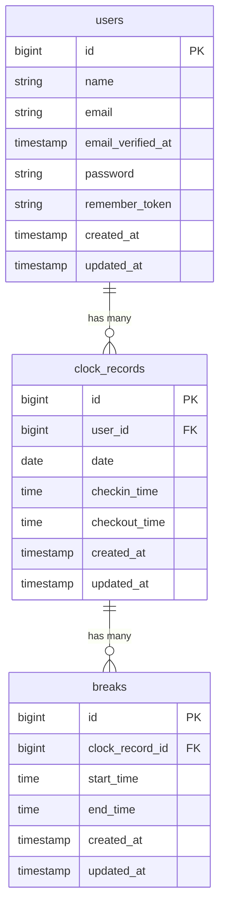

# ClockIn - Intuitive Attendance Management System ⏰

**ClockIn** is a full-stack, responsive web application designed for streamlined employee time tracking. It provides an intuitive interface for clocking working hours and break durations while calculating monthly attendance summary in real-time.
Built with a focus on reliability, the application implements robust **dual-layer protection** (frontend control + backend controller rules) to ensure data integrity and prevent improper clocking actions.

---

## 🚀 Key Features

- **Authentication & Authorization**
  - Secure user registration, authentication, and automatic route redirection based on login status.
- **Clocking System (Dashboard)**
  - Actions: **Clock In**, **Clock Out**, **Break Start**, **Break End**.
  - Real-time user status indicator (`Working`, `On Break`, `Clocked Out`, `Not Clocked In`).
  - **Dual-Layer Validation:** Disabled UI elements combined with backend logic to prevent duplicate or invalid entries (e.g. clocking out without clocking in).
  - Contextual flash notifications (Success / Error feedback).
- **Personal Attendance History (`/my-history`)**
  - Comprehensive monthly logs displaying clocking times, break intervals, and net working hours automatically calculated.
  - Interactive month-by-month navigation (Previous / Next month).
- **Responsive UI/UX**
  - Mobile-first layout adjustments ensuring optimal usability on both desktop and handheld devices.

---

## 🛠 Tech Stack

- **Backend:** PHP 8.x / Laravel 10.x
- **Frontend:** Blade Templates / Tailwind CSS
- **Database:** MySQL 8.0
- **DevOps & Tooling:** Docker (Docker Compose)
- **Version Control:** Git / GitHub (Feature Branch & Pull Request Workflow)
---

## 📊 Database Architecture (ER Diagram)


---

## 💻 Local Setup & Installation 
Follow these steps to set up and run the application locally using Docker:
```bash
# 1. Clone the repository
git clone [https://github.com/clementine515/clock-in.git](https://github.com/clementine515/clock-in.git)
cd clock-in

# 2. Environment configuration
cp .env.example .env

# 3. Start Docker containers
docker compose up -d

# 4. Install PHP dependencies & generate app key
docker compose exec app composer install
docker compose exec app php artisan key:generate

# 5. Run database migrations & seeders
docker compose exec app php artisan migrate --seed

# 6. Start the Laravel development server
docker compose exec app php artisan serve --host=0.0.0.0 --port=8000
```
